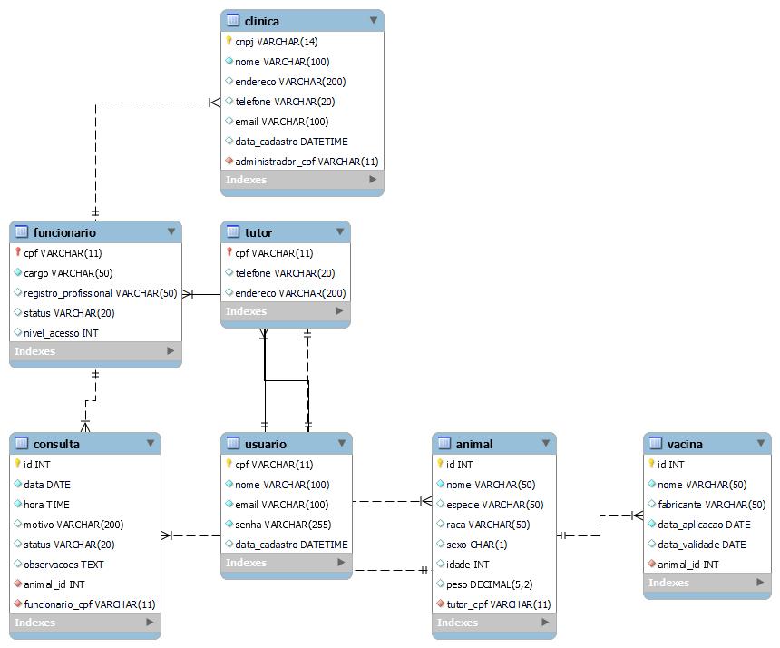

# Modelagem de Dados - AUVET

## Introdução

Este documento descreve a modelagem de dados da aplicação Auvet, incluindo o diagrama Entidade-Relacionamento Estendido (EER) e as principais entidades do sistema de clínica veterinária.

## Diagrama EER



## Entidades Principais

### 1. Clínica
- **Descrição**: Representa as clínicas veterinárias cadastradas no sistema
- **Atributos principais**: CNPJ (chave primária), nome, endereço, telefone, criado_em
- **Relacionamentos**: Uma clínica pode ter múltiplos usuários funcionários

### 2. Usuário
- **Descrição**: Representa os usuários do sistema (Administrador, Funcionário, Tutor)
- **Atributos principais**: CPF (chave primária), nome, email, senha, telefone, role, cnpj_clinica
- **Relacionamentos**: Pertence a uma clínica, pode ser tutor de múltiplos animais, pode realizar múltiplos agendamentos

### 3. Animal
- **Descrição**: Representa os animais de estimação cadastrados no sistema
- **Atributos principais**: id_animal (chave primária), nome, espécie, raça, idade, peso, id_tutor
- **Relacionamentos**: Pertence a um tutor (usuário), pode ter múltiplos agendamentos e vacinas

### 4. Agendamento
- **Descrição**: Representa os agendamentos de consultas e procedimentos
- **Atributos principais**: id_agendamento (chave primária), data_hora, tipo, observações, id_animal, cpf_funcionario
- **Relacionamentos**: Envolve um animal específico e é realizado por um funcionário

### 5. Vacina
- **Descrição**: Representa o histórico de vacinas aplicadas nos animais
- **Atributos principais**: id_vacina (chave primária), nome, data_aplicacao, validade, id_animal
- **Relacionamentos**: Aplicada em um animal específico

## Relacionamentos

- **Clínica-Usuário**: Relacionamento 1:N (uma clínica pode ter múltiplos usuários)
- **Usuário-Animal**: Relacionamento 1:N (um usuário tutor pode ter múltiplos animais)
- **Animal-Agendamento**: Relacionamento 1:N (um animal pode ter múltiplos agendamentos)
- **Usuário-Agendamento**: Relacionamento 1:N (um funcionário pode realizar múltiplos agendamentos)
- **Animal-Vacina**: Relacionamento 1:N (um animal pode receber múltiplas vacinas)

## Script DDL

```sql
CREATE TABLE clinica (
    cnpj VARCHAR(14) PRIMARY KEY,
    nome VARCHAR(100) NOT NULL,
    endereco VARCHAR(255),
    telefone VARCHAR(20),
    criado_em TIMESTAMP DEFAULT CURRENT_TIMESTAMP
);

CREATE TABLE usuario (
    cpf VARCHAR(11) PRIMARY KEY,
    nome VARCHAR(100) NOT NULL,
    email VARCHAR(100) UNIQUE NOT NULL,
    senha VARCHAR(255) NOT NULL,
    telefone VARCHAR(20),
    role VARCHAR(20) NOT NULL,
    cnpj_clinica VARCHAR(14) NOT NULL,
    CONSTRAINT fk_clinica FOREIGN KEY(cnpj_clinica) REFERENCES clinica(cnpj) ON DELETE CASCADE
);

CREATE TABLE animal (
    id_animal INT AUTO_INCREMENT PRIMARY KEY,
    nome VARCHAR(100) NOT NULL,
    especie VARCHAR(50),
    raca VARCHAR(50),
    idade INT,
    peso DECIMAL(5,2),
    id_tutor VARCHAR(11) NOT NULL,
    CONSTRAINT fk_tutor FOREIGN KEY(id_tutor) REFERENCES usuario(cpf) ON DELETE CASCADE
);

CREATE TABLE agendamento (
    id_agendamento INT AUTO_INCREMENT PRIMARY KEY,
    data_hora DATETIME NOT NULL,
    tipo VARCHAR(50),
    observacoes TEXT,
    id_animal INT NOT NULL,
    cpf_funcionario VARCHAR(11) NOT NULL,
    CONSTRAINT fk_animal_agendamento FOREIGN KEY(id_animal) REFERENCES animal(id_animal) ON DELETE CASCADE,
    CONSTRAINT fk_funcionario_agendamento FOREIGN KEY(cpf_funcionario) REFERENCES usuario(cpf) ON DELETE CASCADE
);

CREATE TABLE vacina (
    id_vacina INT AUTO_INCREMENT PRIMARY KEY,
    nome VARCHAR(100) NOT NULL,
    data_aplicacao DATETIME NOT NULL,
    validade DATETIME,
    id_animal INT NOT NULL,
    CONSTRAINT fk_animal_vacina FOREIGN KEY(id_animal) REFERENCES animal(id_animal) ON DELETE CASCADE
);
```


## Histórico de Versões

| Versão | Data | Descrição | Autor |
|--------|------|-----------|-------|
| 1.0.0 | 30/08/2025 | Criação do documento, adição do diagrama EER e adição do script SQL | Izabella Alves Pereira |


